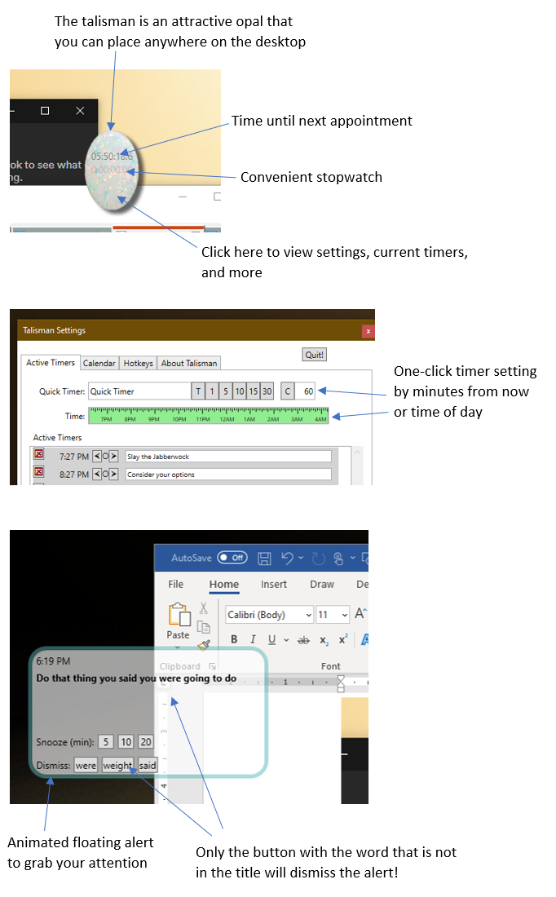

# Talisman

A tool for ADHD folks to make their environment focus friendly.  (Written by a programmer with ADHD!)

Talisman features:

* **Extreme Reminders**:  Ever miss a meeting because Outlook reminders are so flaccid?   Talisman transforms Outlook meeting alerts into hard-to-ignore notifications that literally dance around in front of your work.   The alerts required a tiny bit of cognition related to the appointment title, so users can't automatically dismiss them without first getting pulled out of their focus to recognize what the meeting is about.
* **One-Click Timers:**  Need to make a quick timer without taking so much time that it causes you to lose focus?   Talisman lets you set a quick time with a single click.  You can choose a fixed length timer or a time of day.  
* **Convenient stopwatch**:  There is a stopwatch right on the Talisman floating icon.  No need to bring up a clunky app when you need to take a quick timing. 
* **Hot Keys**:  With talisman active all the time, you can program hot keys that are difficult or impossible to do in windows.   Hot key actions available are:
  * Quick email
  * Instant Lock + Screensaver
  * Snipping tool
  * Instant timer

**Screenshots**

## Building

1. Open src/talisman.sln
2. Right-click on the solution node and select "Restore nuget packages"
3. Build

Building Talisman will generate the Talisman exe, and also talismansetup.exe for convenient installing. 

## 

